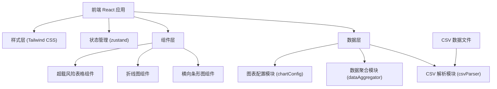

## 1. 架构设计



## 2. 技术说明

- **前端框架**：React 18 + TypeScript
- **构建工具**：Vite 5
- **样式方案**：Tailwind CSS 3
- **状态管理**：zustand
- **图表库**：ECharts 5（功能强大，支持丰富的图表类型和交互）
- **CSV 解析**：papaparse
- **图标库**：lucide-react
- **数据来源**：内置静态 CSV 文件（public 目录）

## 3. 目录结构

```
src/
├── components/
│   ├── BarChart.tsx        # 横向条形图组件
│   ├── LineChart.tsx       # 折线图组件
│   ├── RiskTable.tsx       # 超载风险表格组件
│   └── DashboardHeader.tsx # 看板顶部标题
├── data/
│   ├── csvParser.ts        # CSV 解析模块
│   ├── dataAggregator.ts   # netFlow 聚合计算模块
│   └── chartConfig.ts      # 图表配置模块
├── store/
│   └── useDashboardStore.ts # 看板状态管理
├── types/
│   └── index.ts            # TypeScript 类型定义
├── pages/
│   └── Dashboard.tsx       # 看板主页面
├── App.tsx
├── main.tsx
└── index.css

public/
└── data/
    └── bus_flow.csv        # 公交客流 CSV 数据
```

## 4. 路由定义

| 路由 | 用途 |
|-------|---------|
| / | 看板首页，展示全部分析图表 |

## 5. 数据模型

### 5.1 原始数据结构（CSV）

| 字段名 | 类型 | 说明 |
|--------|------|------|
| stationName | string | 站点名称 |
| hour | number | 小时（6-9） |
| boarding | number | 上车人数 |
| alighting | number | 下车人数 |

### 5.2 计算后数据结构

```typescript
// 单条原始记录
interface BusFlowRecord {
  stationName: string;
  hour: number;
  boarding: number;
  alighting: number;
  netFlow: number;
}

// 站点聚合数据
interface StationAggregate {
  stationName: string;
  totalBoarding: number;
  totalAlighting: number;
  totalNetFlow: number;
  hourlyData: { hour: number; netFlow: number }[];
  riskLevel: 'high' | 'medium' | 'low';
}
```

## 6. 核心模块说明

### 6.1 CSV 解析模块 (csvParser.ts)
- 负责读取和解析 CSV 文件
- 数据校验和类型转换
- 导出解析后的原始记录数组

### 6.2 数据聚合模块 (dataAggregator.ts)
- 计算每条记录的 netFlow = boarding - alighting
- 按站点分组聚合，计算总上下客和总 netFlow
- 生成各站点小时级 netFlow 数据
- 计算风险等级（netFlow ≥ 80 为高风险）
- 支持按 netFlow 降序排序

### 6.3 图表配置模块 (chartConfig.ts)
- 封装 ECharts 配置项生成函数
- 横向条形图配置：站点排名展示
- 折线图配置：时段走势展示
- 统一配色方案和样式配置
